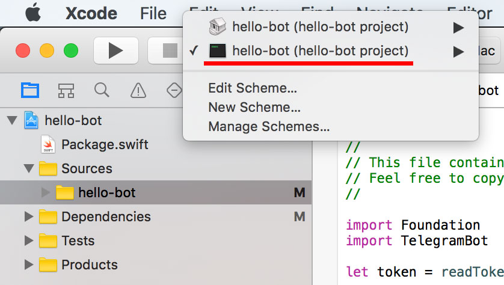
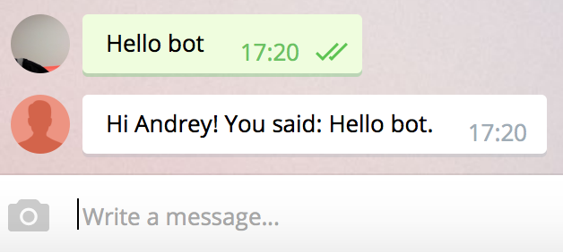

# Creating a new bot

## Create the project

Create a directory for the project, we'll call the bot `todo-bot`:

```bash
mkdir todo-bot
cd todo-bot
swift package init --type executable
```

We now have the following project structure:

```bash
├── Package.swift
├── Sources
│   └── todo-bot
│       └── main.swift
└── Tests
```

Edit Package.swift to look like this:

```swift
import PackageDescription

let package = Package(
    name: "todo-bot",
    products: [
        // Products define the executables and libraries produced by a package, and make them visible to other packages.
        .executable(
            name: "todo-bot",
            targets: ["todo-bot"]),
        ],
    dependencies: [
        // Dependencies declare other packages that this package depends on.
        // .package(url: /* package url */, from: "1.0.0"),
        .package(url: "https://github.com/zmeyc/telegram-bot-swift.git", .branch("dev")),
        ],
    targets: [
        // Targets are the basic building blocks of a package. A target can define a module or a test suite.
        // Targets can depend on other targets in this package, and on products in packages which this package depends on.
        .target(
            name: "hello-bot",
            dependencies: ["TelegramBotSDK"]),
        ]
)
```

Run `swift build`:

```bash
Fetching https://github.com/zmeyc/telegram-bot-swift.git
Fetching https://github.com/zmeyc/CCurl.git
Cloning https://github.com/zmeyc/telegram-bot-swift.git
Resolving https://github.com/zmeyc/telegram-bot-swift.git at dev
Cloning https://github.com/zmeyc/CCurl.git
Resolving https://github.com/zmeyc/CCurl.git at 0.0.2
Compile Swift Module 'TelegramBotSDK' (195 sources)
Compile Swift Module 'todo_bot' (1 sources)
Linking ./.build/x86_64-apple-macosx10.10/debug/todo-bot
```

Try running `.build/x86_64-apple-macosx10.10/debug/todo-bot`:

```bash
Hello, world!
```

## Create Xcode project

Working from command-line without autocomplete is not very convenient. To create Xcode project, run:

```bash
swift package generate-xcodeproj
```

This will produce `todo-bot.xcodeproj`. Open it in Xcode and switch scheme to the bottom one:



Build the project and run it.

## Create a simple bot

Edit `Sources/main.swift` to look like this:

```swift
import TelegramBot

let bot = TelegramBot(token: "TOKEN")

while let update = bot.nextUpdateSync() {
        guard let from = message.from else { ... }
	if let message = update.message, let text = message.text, let from = message.from {
		bot.sendMessageAsync(chat_id: message.from.id,
		                     text: "Hi \(from.first_name)! You said: \(text).\n")
	}
}

fatalError("Server stopped due to error: \(bot.lastError)")
```

Replace TOKEN with the token obtained from [BotFather](https://core.telegram.org/bots#6-botfather).

Run `swift build`. If there are no compilation errors, run `.build/x86_64-apple-macosx10.10/debug/todo-bot`.

If you get `fatal error: Unable to fetch bot information`, verify that the token is correct.
Otherwise, the bot is ready to accept commands.

Find your bot in Telegram and send him something.



Congratulations, you've just created a simple bot!

[Next: API Introduction](api-introduction.md)