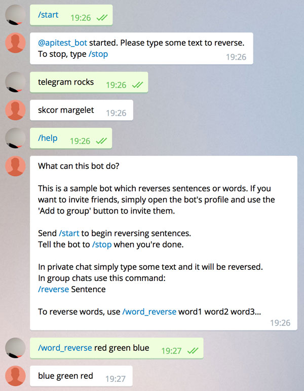

# Examples

## Bots

There are two example projects available:

* `Examples/hello-bot` - a trivial bot which responds to `/greet` command.

* `Examples/word-reverse-bot` - demonstrates how to handle start and stop requests, keep session state and parse command arguments. Behaves differently in private and group chats. Uses a router and a controller.

TBD: an example using an SQLite database.

## Building a bot

Let's build the second example.

```bash
git clone https://github.com/zmeyc/telegram-bot-swift.git
cd telegram-bot-swift/Examples/word-reverse-bot
swift build
```

If everything is correct, you will see:

```bash
Cloning /Users/user/Temp/telegram-bot-swift
Resolved version: 0.2.1
Cloning https://github.com/IBM-Swift/SwiftyJSON.git
Resolved version: 6.0.0
Compiling Swift Module 'SwiftyJSON' (3 sources)
Compiling Swift Module 'TelegramBot' (46 sources)
Compiling Swift Module 'wordreversebot' (1 sources)
Linking .build/debug/word-reverse-bot
```

Storing the token in source code is not a good idea, so there are two options of passing the token to bot:

### Via environment variable:

Add the bot's token to `~/.profile`:
```
export WORD_REVERSE_BOT_TOKEN="TOKEN"
```
Replace `TOKEN` with the token obtained from [BotFather](https://core.telegram.org/bots#6-botfather).

And reload the environment:

```
source ~/.profile
```

### By storing the token in a file:

```
echo "TOKEN" > WORD_REVERSE_BOT_TOKEN
```

### Run the bot

```
.build/debug/word-reverse-bot
```

Add your bot in Telegram, and play with it:



[Next: Creating a new bot](creating-a-new-bot.md)